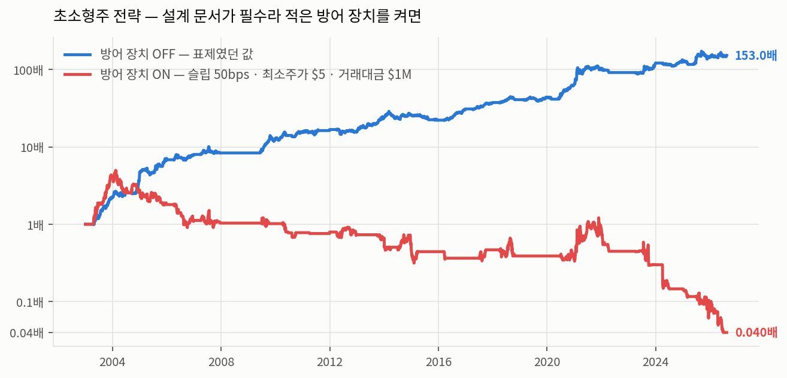
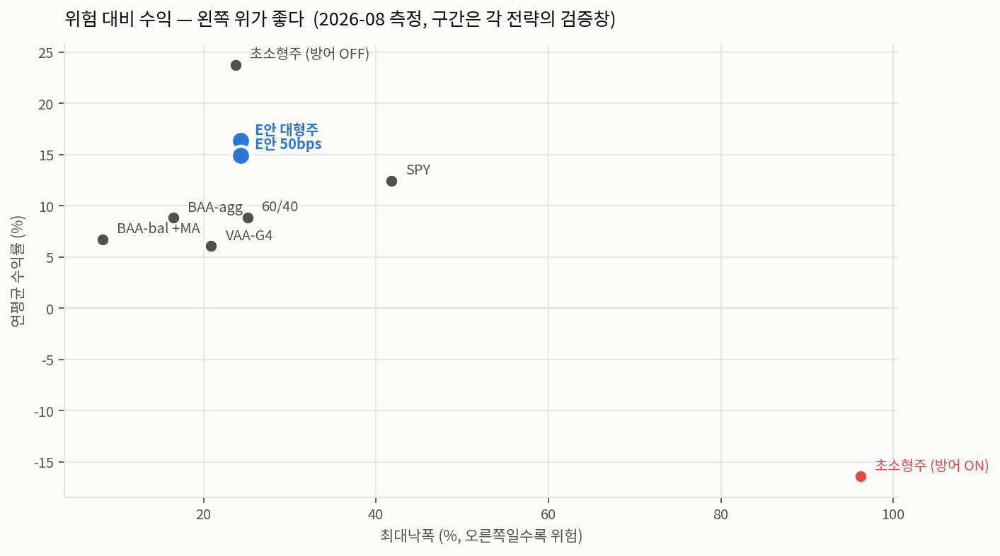

# opt_portfolio

**한국어** · [English](README.md)

**미국 주식 팩터 투자 엔진 + ETF 전술적 자산배분(TAA) 검증 시스템.**

[](https://www.python.org/downloads/)
[](https://opensource.org/licenses/MIT)
[](https://www.linkedin.com/in/younghwan-chae/)

세 개의 서브시스템이 한 저장소에 있다.

| | **팩터 엔진** (`factor/`) | **TAA 자산배분** (`taa/`) | **VAA 원본** (`strategies/`) |
|---|---|---|---|
| 대상 | 미국 개별주 (20,931종목, 1997~2026) | ETF 18종 | ETF 7~11종 |
| 질문 | 어떤 종목을 살까 | 어떤 자산군으로 갈아탈까 | (같음 — 첫 시도) |
| 데이터 | Sharadar 직판 (PIT · 상장폐지 포함) | Sharadar 펀드 벌크 (`closeadj`) | yfinance 일간 종가 |
| 진입점 | `opt-factor` · `opt-factor-tui` | `scripts/run_taa.py` | `make run` · `run.py` |
| 결과 | **채택 1건** (대형주 E안) | **채택 0건** — 9개 전부 PBO 관문 탈락 | 보존 — 왜 실패했는지의 기록 |

**격리 규칙이 하나 있고, 예외가 하나 있다.** 세 시스템은 서로를 import 하지
않는다. 유일한 예외는 `taa/` → `factor.research.overfitting`(DSR·PBO)이다 —
그 함수들은 평범한 수익률 시계열만 받아 결합이 얇고, **관문 없이 만든 성과를
믿지 않는 것이 이 저장소의 규약**이기 때문이다. 반대 방향 import 는 금지한다.

---

# 1. 팩터 엔진

미국 주식 횡단면 팩터 전략을 **검증 가능한 방식으로** 만드는 엔진이다.
핵심 설계 원칙은 하나다 — **조용히 틀리지 않는다.**

## 왜 이 엔진인가

퀀트 백테스트가 실패하는 방식은 대개 정해져 있고, 이 엔진은 그 각각을 구조로 막는다.

| 흔한 실패 | 이 엔진의 대응 |
|---|---|
| 생존편향 — 지금 살아남은 종목만 본다 | 상장폐지 종목 포함 (엔론·구 아메리칸항공 등 실제 확인) |
| Look-ahead — 발표 전 숫자를 쓴다 | 표현식이 원시 테이블에 접근 못 하고 `PanelContext` 만 통과, `datekey` 정렬 강제 |
| 재공시 오염 — 정정된 숫자를 쓴다 | **최초 공시 우선** — 시장이 처음 본 값만 저장 |
| 조용한 절단 — 데이터가 덜 왔는데 성공 처리 | 페이지네이션이 기대 범위 미달 시 `TruncatedDataError` |
| 과최적화 — 수백 번 돌려 최고를 고른다 | **DSR**(Deflated Sharpe) + **PBO** 로 시도 횟수를 정산 |
| 인샘플 성과 보고 | 공식 성과는 **walk-forward** 뿐. 단일 백테스트는 참고용 명시 |

## 성과

<picture>
  <source media="(prefers-color-scheme: dark)" srcset="docs/images/performance-dark.png">
  
</picture>

*세로축은 로그다 — 기울기가 같으면 수익률이 같다. 2008·2012·2022 의 평평한
구간은 200일 이평이 현금으로 뺀 자리다. 그 세 번이 SPY 와 낙폭이 갈리는 지점이다.*

<!-- PERFORMANCE:START -->

*운용 후보 · walk-forward 검증 구간 · 2002-12 – 2026-08 (23.6년)*

**대형주 5팩터 + 200일 이평 타이밍** (`configs/strategy_lean_timed.json`)

| 지표 | 슬리피지 15bps | 슬리피지 50bps | SPY (같은 구간) |
|---|---|---|---|
| 연평균 수익률 | **16.34%** | 14.91% | 11.66% |
| 최대낙폭 | −24.3% | −24.3% | −55.2% |
| 변동성 | 15.7% | 15.7% | 18.6% |
| Sharpe | **0.727** | 0.648 | 0.418 |
| Calmar | **0.67** | 0.61 | 0.21 |
| Deflated Sharpe (파라미터 시도 72회) | **0.996** ✓ | 0.988 ✓ | — |

**이 전략은 방어 장치를 켠 채로 측정됐다** — 최소 주가 $5 · 최소 거래대금 $1M ·
슬리피지. 유니버스가 역대 S&P500 이라 **용량 제약이 없다.** 슬리피지를 50bps 로
올려도 낙폭과 변동성이 그대로고 수익만 1.4%p 깎인다.

> **위 DSR 은 walk-forward 안쪽의 파라미터 시도(72회)만 정산한 값이다.** 그 위에서
> 35개 전략을 훑어 하나를 고른 상위 탐색은 **아직 정산되지 않았다** — 아래를 보시라.

<!-- PERFORMANCE:END -->

### 아직 갚지 않은 것 — 전략 탐색 35회

이 저장소의 관문은 **DSR** 과 **PBO** 두 개이고, 위 표의 DSR 은 walk-forward
**안쪽**만 센다. 그 위에서 35개 전략을 돌려 하나를 고른 행위 자체가 탐색이다.

2026-08-17 에 그걸 재서 **"DSR 0.988 · PBO 0.139 로 관문을 넘는다"** 고 이
자리에 적었다. **그 문장은 철회한다.** 재현 스크립트를 만들어
(`scripts/strategy_search_cost.py`) 다시 재보니 **판정이 집계 방식에 따라
뒤집힌다:**

| 집계 | PBO (n_blocks 8 / 10 / 12 / 16) | 판정 |
|---|---|---|
| **일별** (4,176행) | 0.657 / **0.524** / 0.599 / 0.544 | **전부 탈락** |
| 월별 (201개월) | 0.314 / **0.155** / 0.294 / 0.278 | 전부 통과 |

seed 를 0~5 로 바꿔도 소수점 셋째 자리까지 같다 — **난수 잡음이 아니라 방법
선택이 결론을 정하는 자리다.** DSR 도 같은 방향으로 흔들린다: 50bps 기준
일별 **0.934**(탈락) vs 월별 0.957(통과).

원래 적힌 0.139 는 **월별·`n_blocks=10`, 즉 열여섯 조합 중 가장 유리한 하나**
였다. 그 사실이 어디에도 적혀 있지 않았다.

> 이것이 [CLAUDE.md §1-b](CLAUDE.md) 가 경고한 그대로다 — *성과를 좋아 보이게
> 만드는 실수는 의심할 이유를 만들지 않는다.* 유리한 숫자였기 때문에 아무도
> 다시 재지 않았고, 재현 스크립트가 없어 다시 잴 수도 없었다.

**그래서 지금 정직한 상태는 이렇다:** 이 전략의 상위 탐색 비용은 **정산되지
않았고**, 일별 기준으로는 관문을 넘지 못한다. 어느 집계가 옳은지는 이 저장소가
아직 답하지 못했다 — 추론으로 채우지 않는다.

```bash
uv run python scripts/strategy_search_cost.py   # 위 표를 그대로 재현한다
```

`results/oos/` 의 35개 산출물만 쓰므로 **구독 없이 재현된다.**

### 표제가 바뀐 경위 — 초소형주 전략은 폐기했다

<picture>
  <source media="(prefers-color-scheme: dark)" srcset="docs/images/guards-dark.png">
  
</picture>

*같은 전략, 같은 구간. 다른 것은 슬리피지·최소 주가·최소 거래대금 셋뿐이다.
파란 선이 2026-08-16 까지 이 README 의 표제였다.*

2026-08-16 까지 이 자리에는 **초소형주 8팩터 전략**이 CAGR 23.78% · Sharpe 1.047
로 걸려 있었다. 설계 문서가 필수라고 적은 방어 장치 셋(슬리피지 · 최소 주가 $5 ·
최소 거래대금 $1M)을 켜고 다시 재자 **Sharpe 1.047 → −0.224 · MDD −23.7% → −99.2%**
로 무너졌다.

원인은 실측으로 갈렸다 — 방어를 켜면 **유니버스의 98% 가 사라진다.** 분기말 기준
후보가 15~43종목만 남아, "1,000개 중 상위 20개"가 아니라 "존재하는 전부"를 담게
된다. 팩터 전략이 아니게 되는 것이다. 실제 보유 종목의 일 거래대금 중앙값은 약
$45k 이고 그중 둘은 **0** 이었다. **원금 상한이 1억 남짓**이라는 뜻이다.

같은 검증에서 **슬리피지는 문제가 아니었다** — 150bps 라는 가혹한 가정에서도
DSR 0.995 로 관문을 넘는다. 무너뜨린 것은 유동성 필터다.

그래서 운용 후보를 대형주 E안으로 바꿨다. E안은 원래 *"수익률이 낮다"* 는 이유로
밀려 있었는데, **E안은 처음부터 방어가 켜져 있었고 초소형주 전략은 꺼져 있었다** —
두 전략을 같은 조건으로 비교한 적이 없었다. 같은 조건에서는 DSR 0.996 vs 0.002 다.

전 과정은 [`docs/factor-system/07-experiment-log.md`](docs/factor-system/07-experiment-log.md)
§5.5·§5.8 에 있다.

### 만든 것 전부를 한 장에

<picture>
  <source media="(prefers-color-scheme: dark)" srcset="docs/images/risk-return-dark.png">
  
</picture>

*왼쪽 위가 좋다. 파란 점이 채택한 것, 빨간 점이 폐기한 것이다. 아래쪽의
VAA-G4 · BAA · 60/40 은 이 저장소가 만들어 놓고 **채택하지 않은** 전술적
자산배분 구성들이다 — PBO 0.770 으로 관문에서 탈락했다
([`docs/taa/01-results.md`](docs/taa/01-results.md)).*

**구간이 서로 다르다** — 팩터 계열은 2002-12~2026-08, TAA 계열은
2008-07~2026-08(218개월)에서 쟀다. 그래서 여기 SPY(−41.8%)는 위 성과표의
SPY(−55.2%)와 다른 숫자다 — 2008년 하락의 앞부분이 TAA 창 밖에 있다.
같은 눈금 위에 있다고 같은 시험을 친 것은 아니다.

### 전부 공개한다

엔진도, 158팩터 정의도, **채택 파라미터도** `configs/` 에 그대로 있다. 한때
감췄다가 열었다 — 감춘 레시피(초소형주)는 방어 장치를 켜면 무너져 실제로 굴릴
물건이 아니었고, 실제로 쓸 대형주 전략은 용량 제약이 없어 감출 이유가 없었다.
경위는 [`configs/README.md`](configs/README.md).

### 이 곡선을 믿기 전에

**구조적으로 튼튼한 것**: 룩어헤드 없음(파라미터는 학습 구간 안에서만 고르고 검증
구간은 한 번만 실행), 생존편향 없음(폐지 종목이 유니버스에 있다), 재공시 미사용
(최초 공시 우선), 수수료·슬리피지·유동성 필터 모두 켠 상태.

**남은 한계**:

| 항목 | 내용 |
|---|---|
| **구간** | 2002-12 이후 23.6년, walk-forward 24폴드. 그 안의 대형 하락은 2008·2020·2022 세 번뿐이다 |
| **데이터 정지** | 2026-08-14 에서 멈춰 있다 (구독 종료). 이후 갱신 없음 |
| **세금** | 모델링하지 않았다 |
| **거래비용** | 15bps 와 50bps 두 가정을 모두 보고한다. 실제 스프레드를 보유 종목으로 재보지는 않았다 |

**Deflated Sharpe 가 이 표에서 가장 중요한 숫자다.** 같은 데이터로 여러 번 시도해 고른 결과에서, 순수한 노이즈만으로 기대되는 최대 Sharpe 를 빼고 남는 값이다. 0.95 를 넘지 못하면 채택하지 않는다 — 실제로 이 저장소에서 20개 넘는 전략이 이 관문에서 탈락했다.

전 과정 기록은 [`docs/factor-system/07-experiment-log.md`](docs/factor-system/07-experiment-log.md) 에 있다.

## 팩터 라이브러리 — 158개

팩터를 158개 함수로 구현하지 않는다. **선언적 표현식(DSL)** 으로 쓰면 TTM·QoQ·YoY·가속 파생형이 자동 생성된다.

```python
from opt_portfolio.factor.dsl.expr import F
from opt_portfolio.factor.dsl.registry import factor

# 현금 기반 영업수익성 (Ball et al. 2016)
CBOP = factor(
    "CBOP",
    (F.gp - _delta(F.receivables) - _delta(F.inventory) + _delta(F.liabilitiesc)) / F.assets,
    category="quality",
    direction=1,
    neutralize=("sector",),   # 섹터 중립화
)
```

| 카테고리 | 개수 | 예 |
|---|---|---|
| quality | 55 | GP_A, ROIC, F-Score, 발생액, 순영업자산 |
| growth | 26 | 매출·이익 YoY/QoQ |
| price | 24 | 모멘텀 1/3/6/12개월, 12-1, 저변동성 |
| value_price | 24 | PER, PBR, PSR, PFCR, PGPR |
| acceleration | 15 | 성장률의 2차 미분 |
| value_ev | 9 | EV/EBITDA, EV/GP |
| flow_proxy | 5 | 13F 기관 보유 변화, 내부자 순매수 |

문헌 근거가 있는 것만 담는다 — Novy-Marx(2013), Sloan(1996), Hirshleifer et al.(2004), Daniel & Titman(2006), Ball et al.(2016), Chen & Zimmermann 오픈소스 라이브러리 복제 등.

## 사용법

> **이 저장소의 데이터는 2026-08-14 에서 멈춰 있다.** 구독을 종료했으므로 갱신은
> 없다. 산출물은 [`results/`](results/) 에 있어 **성과 검산은 되지만 재실행은
> 안 된다** — 재실행하려면 아래 구독이 필요하다. 벤더 원본은 유료 구독물이라
> 재배포할 수 없다(라이선스 문제이지 공개 방침의 문제가 아니다).
>
> **데이터 요건.** 팩터 엔진은 [Sharadar](https://sharadar.com) 구독이 있어야 돌아간다 (Bundle, 월 $29~). 개인 가격대에서 **PIT 재무 + 상장폐지 종목**을 함께 주는 곳이 여기뿐이다. 없으면 엔진은 돌지만 돌릴 데이터가 없다. 벤더는 중립 `Provider` 프로토콜 뒤에 격리돼 있어 교체 시 파일 하나만 다시 쓰면 된다. `taa/` 도 같은 Sharadar 벌크(펀드 테이블)를 쓴다. 구독 없이 도는 것은 `strategies/` 의 VAA 원본뿐이다 (yfinance).

```bash
# 데이터 적재 (Sharadar 구독 필요)
export SHARADAR_API_KEY=...
opt-factor ingest --store us.duckdb --provider sharadar \
  --tables sf1,sep,daily,actions,sp500,tickers
# Sharadar 전체 유니버스를 적재한다. 좁히려면 --tickers-file 에 직접 만든 파일을
# 넘긴다(TICKERS 벌크 CSV 또는 줄·쉼표 구분 텍스트).

# 팩터 예측력 검증 — 10분할 · IC · 회전율
uv run python scripts/factor_lab.py --store us.duckdb --factors GP_A,PER,SIZE

# 공식 성과 (walk-forward + DSR)
opt-factor optimize --store us.duckdb \
  --config configs/strategy.json \
  --space configs/space.json --objective calmar

# 오늘 살 종목 (현재 보유를 주면 매매 계획까지)
opt-factor holdings --store us.duckdb \
  --config configs/strategy.json --current 내보유.csv

# 운용 화면
opt-factor-tui --store us.duckdb --config configs/strategy.json
```

전략은 JSON 한 파일로 완전히 선언된다. 아래는 **폐기된 초소형주 전략**
(`configs/strategy_quantus_timed.json`)이다 — 방어 장치를 끈 상태가 어떤 모습인지
보이려고 남긴다. 운용 후보는 `configs/strategy_lean_timed.json` 이다.

```jsonc
{
  "factors": ["PER", "PSR", "POR", "PGPR",
              "NETINC_GROWTH_YOY", "OPINC_GROWTH_YOY",
              "GP_GROWTH_YOY", "REVENUE_GROWTH_YOY"],
  "universe": {
    "min_mcap_usd": 5000000, "max_mcap_usd": 80000000,
    "min_price_usd": 0.0,                      // ⚠ 설계 문서는 $5 를 필수라 적었다
    "min_adv_usd": 0.0,                        // ⚠ 설계 문서는 $1M 을 필수라 적었다
    "exclude_financials": true, "exclude_distressed": true
  },
  "backtest": {
    "n_stocks": 20, "rebalance": "QE", "weighting": "equal",
    "max_weight": 0.06,
    "cost": {"commission_bps": 50, "slippage_bps": 0}   // ⚠ 기본값은 10
  },
  "timing_ma_days": 200,                       // 마켓타이밍 오버레이
  "timing_reentry_days": 5
}
```

> ⚠ 표시한 셋은 **설계 문서가 필수라고 적은 방어 장치를 끈 것**이다. 켜면 이
> 전략은 무너진다 (Sharpe 1.047 → −0.22). 그 검증이
> [`07-experiment-log.md`](docs/factor-system/07-experiment-log.md) §5.5 다.
> 이 설정을 그대로 쓰지 마시라 — 무엇이 왜 문제인지 보이려고 공개한다.

### 포트폴리오 구성 기법 — 무엇을 만들었고 무엇이 살아남았나

**구현과 채택은 다르다.** 아래는 전부 테스트와 함께 들어와 있고, 판정 칸은
walk-forward 가 이 유니버스에서 내린 답이다.

| 기법 | 판정 |
|---|---|
| 마켓타이밍 오버레이 (Faber 200일 이평) | **채택** — 낙폭 −63.8% → −23.7% (초소형주 기준. 운용 후보 E안도 이 오버레이를 쓴다) |
| 균등가중 | **채택** — 최적화 6종을 전부 이겼다 (DeMiguel 1/N) |
| 매매 유예구간 (`hold_multiple`) | **기각** — 회전율 −23% 대신 수익 −0.86%p |
| 레짐 조건부 팩터 가중 | **기각** — 16.90% → 15.45%, 레짐당 표본 부족 |
| 변동성 타게팅 (Moreira & Muir 2017) | **기각** — 단독으로 쓰면 타이밍을 아예 안 한 것보다 나쁘다 (Sharpe 0.513 → 0.396) |
| 파라미터 앙상블 (`--ensemble k`) | **기각** — 표에서 CAGR 은 제일 높지만 낙폭 −23.7% → −30.6%, Calmar 0.71 → 0.60 |
| 섹터 비중 상한 (`max_sector_weight`) | **성과 중립** — 차이가 0 과 구분되지 않는다 (t = 0.77). 수익 장치가 아니라 위험 장치로 남긴다 |
| 학습 구간 내 팩터 선별 (IC / 잔차 기여도) | **미채택** — 둘 다 고정 8팩터와 차이를 잴 수 없다 (t ≈ 0.5). 고정 쪽이 DSR 이 높고 움직이는 부품이 적다 |

뒤 세 개는 정교해 보여서가 아니라 **측정이 가리켜서** 만들었다 — 섹터 상한은
실제 보유 포트폴리오가 Technology 32% 로 드러난 뒤에 썼다. 그건 아무도 선택하지
않은 매크로 베팅이다.

## 검증 도구

| 도구 | 무엇을 답하는가 |
|---|---|
| `scripts/factor_lab.py` | 이 팩터에 예측력이 있는가 (10분할 스프레드 · 단조성 · 회전율) |
| `research/ic.py` | Rank IC · IC-IR · 감쇠 프로파일 |
| `research/overfitting.py` | **이 성과가 우연인가** — DSR · PBO(CSCV) |
| `research/regime.py` | 어느 국면에서 작동하는가 (추세 × 변동성 2×2) |
| `research/selection.py` | 팩터 선택을 학습 구간 안에서 — 조합 탐색의 정직한 형태 |
| `optimize/walkforward.py` | 확장·롤링 윈도, 엠바고, 폴드별 파라미터 안정성 |

비중 스킴은 7종이다 — 균등 · 시총 · 역변동성 · 리스크패리티 · HRP · MVO · Black-Litterman.
다만 **이 저장소의 실증 결과는 균등가중이 이긴다** (DeMiguel et al. 2009 의 1/N 결과가 두 번 재현됐다).

---

# 2. 전술적 자산배분 (TAA)

개별주가 아니라 **ETF 몇 종 사이를 매달 갈아타는** 쪽이다. 여기 결과는 하나다 —
**9개 구성을 사전등록해 전부 기각했다.** 그 과정이 이 섹션의 내용이다.

## VAA 로 시작했고, VAA 는 실패했다

Wouter Keller 의 Vigilant Asset Allocation(2017)이 출발점이었다.

```
모멘텀 = 12·R(1M) + 4·R(3M) + 2·R(6M) + 1·R(12M)      ← Keller 13612W
```

- **공격 유니버스**(`SPY`·`EFA`·`EEM`·`AGG`) 중 모멘텀 1위를 산다.
- 단 넷 중 **하나라도 절대 모멘텀이 음수**면 위험 신호로 보고 **방어
  유니버스**(`LQD`·`IEF`·`SHY`) 중 1위로 전환한다 (breadth 규칙).

논문은 연 16~17% 를 적었는데 **실측은 연 6.07%** 였다 (2008-07~2026-08, 218개월).
구현이 틀린 게 아니다 — 원인을 재보면 이렇다.

| 무엇 | 실측 |
|---|---|
| 전체 기간 중 **방어 자산**으로 보낸 비중 | **55.7%** |
| 그중 `SHY` 한 종목에 묶인 기간 | 44개월 — 당시 연 0.05%, 사실상 현금 |
| Keller 의 검증 구간 | 1970~2015 — **그 시절 방어 자산이 연 8~15% 를 줬다** |

즉 VAA 는 절반 이상을 "안전한 곳"에 두는 전략인데, **2008년 이후의 안전한 곳은
수익이 0 이다.** 전제가 시대와 안 맞는다. 상세: [설계 문서](docs/superpowers/specs/2026-08-17-taa-strategy-design.md) §0.

> 별개로, 이전 버전 README 는 Sharpe 를 **20.9배** 부풀려 적고 있었다 — 월별
> 수익률을 √252 로 연율화한 버그다(정상은 √12, `b9043d7` 수정). 성과는 맞는데
> 위험지표만 틀린 상태라 오래 살아남았다. 회귀 테스트: `tests/test_risk_annualization.py`.

## 그래서 대체할 것을 만들었다 — 그리고 그것도 기각했다

VAA 의 병은 **오발이 아니라 오발했을 때 무엇을 사는가**였다. 그래서 카나리아
(경보 자산)를 투자 대상에서 분리하는 Keller 의 후속 BAA(2022)를 중심으로
**9개 구성을 결과를 보기 전에 등록**하고 한 번에 쟀다.

| 구성 | CAGR | MDD | Calmar | DSR |
|---|---|---|---|---|
| `spy` (기준선) | 12.46% | −41.8% | 0.298 | 0.968 |
| `static_60_40` (기준선) | 8.87% | −25.1% | 0.354 | 0.986 |
| `vaa_g4` | 6.07% | −20.9% | 0.290 | 0.871 |
| `baa_agg` | 8.82% | −16.5% | 0.535 | 0.976 |
| `baa_bal` | 7.28% | −11.1% | 0.654 | 0.994 |
| `baa_agg_ma` | 8.81% | −13.4% | 0.656 | 0.985 |
| `baa_bal_tranche` | 8.11% | −11.3% | 0.717 | 0.996 |
| `baa_bal_ma_tranche` | 7.32% | −10.0% | 0.731 | 0.997 |
| `baa_bal_ma` | 6.72% | **−8.3%** | **0.812** | 0.997 |

**PBO = 0.770 → 채택 0건.** 완화하지 않았다.

PBO 0.77 은 *"이 9개 중 인샘플 1등을 뽑아도 아웃샘플에서 중간 이하로 떨어질
확률이 77%"* 라는 뜻이다. **"아무것도 안 통한다"는 뜻이 아니다** — 그리고 이
구분이 이 섹션에서 가장 중요하다. 실제로 BAA 계열 6개는 **예외 없이 전부**
60/40 을 Calmar 로 이긴다(0.535~0.812 vs 0.354). 동시에 그 6개끼리만 PBO 를
재면 **0.861** 로, 어느 것이 최선인지는 이 데이터로 고를 수 없다.

> 두 문장은 같이 있어야 한다. "BAA 가 60/40 을 이긴다"와 "BAA 중 무엇이
> 최선인지는 모른다"는 **둘 다 참**이고, 어느 한쪽으로 뭉개면 틀린 결론이 된다.

정직하게 시험하려면 **BAA 하나를 미리 골라 60/40 과 단일 가설로 사전등록**해야
한다. 성과가 가장 좋은 것을 사후에 골라 "이게 이긴다"고 하는 것은 이 저장소가
팩터 쪽에서 이미 한 번 저지른 실수다.

## 이 라운드에서 잡은 결함

**채택이 0건이라 결과보다 이쪽이 값어치 있다.** 거의 전부가 성과를 **좋아 보이게**
만드는 방향이었다 — 그런 실수는 의심할 이유를 만들지 않아 오래 산다.

근거 문서의 §3(방법론 결함 1건)과 §4(구현 결함 6건) 전부에, 코드에만 기록된
1건을 더한 목록이다.

| # | 결함 | 영향 |
|---|---|---|
| §3 | 트랜치가 **가격 패널 전체를 시프트**해 슬리브마다 다른 기간을 쟀다 | 분산이 아니라 평활화. 슬리브 상관 0.381(정상 0.819). 고치자 **PBO 0.139 → 0.770** |
| §4-1 | 수익률 라벨이 한 달 밀려 있었다 (계획서 결함) | 결정 월이 아니라 실현 월로 라벨링해야 룩어헤드가 없다 |
| §4-2 | 공통 구간이 스펙에 2007-06 이라 적혔으나 실제는 2008-07 (`BIL` 상장 + 워밍업) | 230개월 → **218개월** |
| §4-3 | 구성 9가 구성 8의 **조용한 복제본**이었다 (`if`/`elif` 디스패치) | 사전등록 9개 중 실질 8개만 달랐다 |
| §4-4 | §5 는 PBO 를 주 관문으로 적었는데 §6 채택 공식에는 PBO 가 없었다 | 패시브 기준선(`spy`·`60/40`)까지 "PBO 초과"로 기각된다 — 탐색의 산물이 아닌데도 |
| §4-5 | `run_with_ma_overlay`·`run_with_tranches` 가 "equity 에 원금을 붙인다"는 규약을 안 따랐다 | 트랜치 MDD −9.35% → 실제 −10.99%. 하필 **개선안 4개**에만 유리한 오차였다 |
| §4-6 | 같은 원금 누락이 `summarize()` 에 **따로 또** 있었다 | `baa_bal_tranche` MDD −9.72% → −11.31%. 하나를 고쳐도 다른 하나는 안 고쳐진다 |
| (코드) | `pandas.pct_change()` 기본값이 결측을 앞값으로 메워 **0% 수익을 조작**한다 | 전 신호 계산에 `fill_method=None` 강제 (`taa/signals.py` 주석) |

전 과정과 사전 예상 대조는 [`docs/taa/01-results.md`](docs/taa/01-results.md) 에 있다.

```bash
uv run python scripts/run_taa.py    # 9개 구성 · PBO · 판정표

make run                            # VAA 원본 (yfinance, 보존용)
python3 run.py --backtest
```

---

## 구조

```
src/opt_portfolio/
├── factor/                    # 미국 주식 팩터 엔진
│   ├── data/                  #   벤더 어댑터 · PIT 스토어 (DuckDB)
│   ├── dsl/                   #   표현식 트리 · PIT 평가 컨텍스트 · 레지스트리
│   ├── library/               #   팩터 158개 선언
│   ├── universe/              #   유동성·시총·섹터 필터
│   ├── portfolio/             #   스코어 합성 · 비중 7종 · 수축 공분산
│   ├── backtest/              #   횡단면 백테스트 · 비용 · 마켓타이밍
│   ├── optimize/              #   walk-forward · grid/random/GP-EI 탐색
│   ├── research/              #   IC · 분위수 · DSR/PBO · 레짐 · 팩터 선택
│   ├── holdings.py            #   오늘 살 종목 · 매매 계획
│   └── tui.py                 #   운용 화면
├── taa/                       # 전술적 자산배분 — 9개 구성 사전등록·PBO 관문
│   ├── data.py                #   Sharadar 펀드 벌크 → 배당조정 가격 패널
│   ├── signals.py             #   13612W 모멘텀 · 200일 이평
│   ├── strategy.py            #   StrategySpec (카나리아/공격/방어 유니버스)
│   ├── backtest.py            #   월별 리밸런싱 · 이평 오버레이 · 트랜치
│   ├── registry.py            #   사전등록 9개 구성 · N_TRIALS
│   └── evaluate.py            #   DSR · PBO · 채택 판정
├── strategies/                # VAA 원본 — 모멘텀 · 자산 선택 · OU 예측(실험)
├── analysis/                  # 백테스트 · 최적화 · 리스크 · 성과
├── core/                      # DuckDB 증분 캐시 · 포지션
└── config.py                  # frozen dataclass 설정
```

## 설치 & 개발

```bash
make install        # uv sync --extra dev
make test           # pytest + 커버리지 (399 tests)
make lint           # ruff check + format --check
make typecheck      # mypy src/
```

패키지 관리는 **uv** 다 (`uv.lock`). `pip install` 하지 않는다.

## 문서

| 파일 | 내용 |
|---|---|
| [`00-overview.md`](docs/factor-system/00-overview.md) | 설계 개요 · 데이터 소스 선정 근거 |
| [`01-factor-spec.md`](docs/factor-system/01-factor-spec.md) | 팩터 정의 |
| [`02-universe-spec.md`](docs/factor-system/02-universe-spec.md) | 유니버스 필터 |
| [`04-data-contract.md`](docs/factor-system/04-data-contract.md) | **스토어 스키마 · PIT 규약 · 벤더 실측 · 운영 절차** |
| [`05-math-spec.md`](docs/factor-system/05-math-spec.md) | 가중·백테스트·walk-forward 수식 |
| [`06-provider-review.md`](docs/factor-system/06-provider-review.md) | 데이터 벤더 12종 비교 |
| [`07-experiment-log.md`](docs/factor-system/07-experiment-log.md) | **실험 기록 — 채택 전략 · 기각 목록 · 재현 절차** |
| [`taa/01-results.md`](docs/taa/01-results.md) | **TAA 결과 — 9개 구성, 채택 0건, 잡은 결함 6종** |

## 한계와 가정

**팩터 엔진 (운용 후보 = 대형주 E안)**

- **구간 안의 대형 하락이 세 번뿐이다** (2008 · 2020 · 2022). 낙폭 방어를 주장하는 전략의 근거가 사건 3개라는 뜻이다. 이것이 남은 한계 중 가장 크다.
- **거래비용은 가정이지 실측이 아니다.** 15bps 와 50bps 두 가정을 모두 보고하고 결론은 둘 다에서 같지만(DSR 0.996 / 0.988), **실제 보유 종목의 호가 스프레드를 재본 적은 없다.** 유니버스가 역대 S&P500 이라 초소형주만큼 위험하진 않다.
- **데이터가 2026-08-14 에서 멈췄다** (구독 종료). 이후 갱신 없음 — `ingest` 는 실패하고 그건 버그가 아니다.
- 세금 미반영.

> **갚은 부채 하나.** 예전 이 자리에는 *"팩터 선택은 DSR 시도 횟수에 정산되지
> 않았다"* 가 적혀 있었다. 2026-08-17 에 35개 산출물 전부를 공통 구간으로 맞춰
> 다시 재 **DSR 0.988 · PBO 0.139** 로 관문을 통과시켰다. 위 성과표의 마지막
> 두 줄이 그것이다.

**TAA**

- **채택이 0건이므로 운용에 쓸 결론이 없다.** PBO 0.770 을 완화하지 않았다.
- 표본 218개월, 그 안의 하락 역시 세 번뿐이다.
- 마지막 달은 **반달치**다 — 데이터가 2026-08-14 에서 멈춰 `to_monthly` 가 반달 움직임을 한 달로 라벨링한다. `run_taa.py` 가 경고를 찍는다.
- ETF 상장 이전은 볼 수 없다. 논문들은 지수 대용으로 1970년대까지 가지만 여기선 실제 ETF 가격만 썼다.

**VAA 원본 (`strategies/`, 보존용)**

- 최적화 비중은 in-sample 값이다. 거래비용 0.1% 고정, yfinance 일간 종가, 단일 15년 윈도우.
- **이쪽 숫자는 `taa/` 의 `vaa_g4` 와 다르다** — 데이터 소스도 구간도 다르다. 비교하려면 `taa/` 쪽을 쓰시라.

> ⚠️ 모든 백테스트는 과거 데이터 기준이며 미래 수익을 보장하지 않는다.

## 라이선스

MIT

---

## ⭐ 도움이 되셨다면

이 프로젝트가 유용했다면 우측 상단 **[⭐ Star](https://github.com/younghwan91/opt_portfolio)** 를 눌러주세요. 검색·추천 노출이 올라가 더 많은 분들이 찾을 수 있습니다.

- 🐛 버그·질문 → [Issues](https://github.com/younghwan91/opt_portfolio/issues)
- 📈 업데이트 소식 → [팔로우 @younghwan91](https://github.com/younghwan91)

## 관련 프로젝트 — 오픈소스 퀀트 스택

한국·미국 주식과 암호화폐를 아우르는 오픈소스 스택입니다. 각 저장소는 독립적으로 쓸 수 있습니다.

| 축 | 프로젝트 | 설명 |
|---|---|---|
| 🇰🇷 한국 주식 | **[kiwoom-rest-api](https://github.com/younghwan91/kiwoom-rest-api)** | 키움증권 REST API Python 라이브러리 — 국내주식 엔드포인트 전수·실시간 WebSocket, sync + async (`pip install kiwoom-client`) |
| 🇰🇷 한국 주식 | **[krx-fundamentals-api](https://github.com/younghwan91/krx-fundamentals-api)** | 국내 기업 펀더멘탈 REST API — 재무제표·투자지표·배당·종목 스크리닝 (DART + KRX + 네이버) |
| 🇰🇷 한국 주식 | **[krx-news-rest-api](https://github.com/younghwan91/krx-news-rest-api)** | 한국 주식 뉴스·공시 수집 REST API (FastAPI + Redis) |
| 🇰🇷 한국 주식 | **[quant-airflow](https://github.com/younghwan91/quant-airflow)** | 시세·수급·실적을 TimescaleDB 로 수집하는 Airflow 파이프라인 — 상장폐지 종목까지 담아 생존편향을 막는다 |
| 🇰🇷 한국 주식 | **[kr-quant](https://github.com/younghwan91/kr-quant)** | 코스피·코스닥 알파 리서치 — walk-forward·랜덤 음성대조·purged CV·Deflated Sharpe 를 CI 가드레일로 강제 |
| 🇺🇸 미국 주식 | **[automated-stock-trading-systems](https://github.com/younghwan91/automated-stock-trading-systems)** | Bensdorp 의 7개 비상관 트레이딩 시스템 백테스터 (교육용 재구현) |
| ₿ 암호화폐 | **[quantbox-engine](https://github.com/younghwan91/quantbox-engine)** | 암호화폐 선물 백테스트·실행 엔진 — 룩어헤드 0, 백테스트↔실거래 일체화 |

## 만든 사람

**채영환 (Younghwan Chae)** · [GitHub @younghwan91](https://github.com/younghwan91) · [LinkedIn](https://www.linkedin.com/in/younghwan-chae/)

전체 오픈소스 퀀트 스택은 [프로필](https://github.com/younghwan91)에서 한눈에 볼 수 있습니다.
