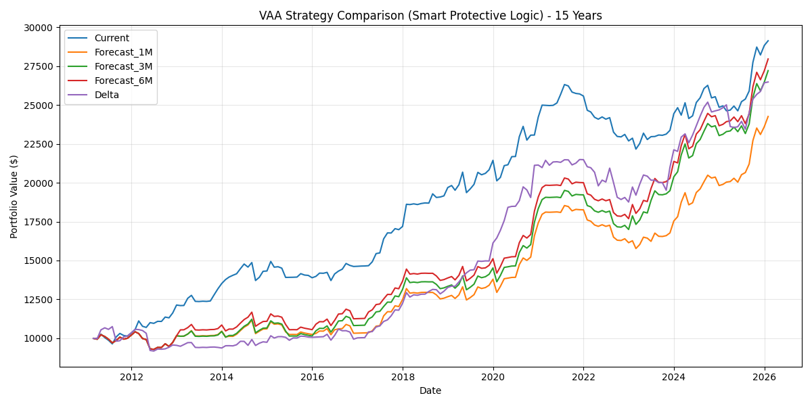

# opt_portfolio

**Vigilant Asset Allocation(VAA) 기반 전술적 자산배분 백테스트·최적화 시스템.**

[](https://www.python.org/downloads/)
[](https://opensource.org/licenses/MIT)

매월 모멘텀 신호로 ETF를 동적으로 갈아타는 VAA 전략을 구현하고, 비중을 Sharpe 비율 기준으로 최적화한다. 백테스트·리스크 분석·예측 모듈을 함께 제공한다.

> VAA는 Wouter Keller가 발표한 공개 전략이다. 이 레포의 초점은 "비법 전략"이 아니라, **공개된 전술적 자산배분 규칙을 정확히 구현하고 walk-forward로 정직하게 검증하는 파이프라인**에 있다.

---

## 방법론

### 모멘텀 점수 (Keller 13612)

각 자산의 모멘텀을 기간 가중합으로 계산한다.

```
momentum = 12·R(1M) + 4·R(3M) + 2·R(6M) + 1·R(12M)
```

최근 수익률에 더 큰 가중치를 둬 추세 전환에 민감하게 반응한다.

### VAA 선택 규칙

- **공격 유니버스**(`SPY`, `EFA`, `EEM`, `AGG`) 중 모멘텀 1위 자산을 선택한다.
- 단, 공격 자산 중 **하나라도 절대 모멘텀이 음수**면 위험 회피 신호로 보고, **방어 유니버스**(`LQD`, `IEF`, `SHY`) 중 모멘텀 1위로 전환한다.
- 이렇게 고른 ETF에 50%, 코어 자산(`SPY`, `TLT`, `GLD`, `BIL`)에 각 12.5%를 배분한다(Keller 기반 기본값, 조정 가능).

### 비중 최적화

VAA 선택분 20–70%, 코어 자산 각 5–35% 범위를 그리드 서치로 훑어 **Sharpe 비율이 최대가 되는 조합**을 찾는다.

### 백테스트 / 리스크

- **월간 walk-forward** 시뮬레이션, **거래비용 0.1%** 반영 → 결과는 net 기준.
- 리스크 지표: Sharpe, Sortino, 최대 낙폭(MDD), VaR/CVaR, 베타, 트래킹 에러.
- 무위험 수익률 5% 가정(2025 기준).
- `ou_process.py`는 Ornstein-Uhlenbeck 평균회귀로 모멘텀을 예측하는 실험적 변형이다.

### 자산 유니버스

| 구분 | 티커 | 역할 |
|---|---|---|
| 공격(aggressive) | SPY, EFA, EEM, AGG | 위험 선호 구간에서 모멘텀 추종 |
| 방어(protective) | LQD, IEF, SHY | 위험 회피 신호 시 전환 |
| 코어(core) | SPY, TLT, GLD, BIL | 고정 분산 배분 |

## 백테스트 결과



2011–2026년 15년 구간, 초기 $10,000 기준 비교다. `Current`는 표준 VAA 모멘텀 로직, `Forecast_1M/3M/6M`은 OU 예측을 끼운 변형이다.

- 표준 VAA(`Current`)가 ~$29k로 OU 예측 변형들(~$24–27k)을 **앞선다.** 예측 레이어를 더한다고 나아지지 않았다 — 단순한 규칙이 이긴 셈.
- 2018·2022 같은 하락 구간에서 방어 전환이 낙폭을 줄였다.

> ⚠️ 백테스트는 과거 데이터 기준이며 미래 수익을 보장하지 않는다. 한계는 [아래](#한계와-가정) 참고.

## 구조

레이어로 관심사를 나눴다.

```
src/opt_portfolio/
├── strategies/        # 전략
│   ├── momentum.py    #   Keller 13612 모멘텀
│   ├── vaa.py         #   공격/방어 유니버스 선택 + 방어 전환
│   └── ou_process.py  #   OU 평균회귀 예측 (실험적)
├── analysis/          # 분석
│   ├── backtest.py    #   월간 walk-forward + 거래비용
│   ├── optimizer.py   #   Sharpe 그리드 서치
│   ├── risk.py        #   Sharpe/Sortino/MDD/VaR/CVaR/beta
│   └── performance.py #   CAGR, 롤링 수익률, 성과 기여도
├── core/
│   ├── cache.py       #   DuckDB 증분 캐시 (없는 구간만 yfinance 호출)
│   └── portfolio.py   #   포지션·거래·리밸런싱
├── ui/
│   ├── streamlit_app.py  # 웹 UI (Plotly)
│   └── cli.py            # 터미널 메뉴
└── config.py          # frozen dataclass 설정 (싱글턴)
```

## 설치 & 실행

```bash
make install        # uv sync --extra dev

make run            # 인터랙티브 메뉴
make web            # Streamlit 웹 UI
python3 run.py --backtest    # 동적 VAA 백테스트
python3 run.py --optimize    # Sharpe 비중 최적화
```

코드로 직접 다룰 때:

```python
from opt_portfolio.analysis.backtest import BacktestEngine

engine = BacktestEngine()

# 기본 비중으로 15년 백테스트
result = engine.run_dynamic_vaa_backtest(years=15)
print(result.sharpe_ratio, result.cagr, result.max_drawdown)
print(result.get_selection_summary())   # 월별 VAA 선택 분포

# 커스텀 비중 (합 = 1.0)
weights = {"VAA": 0.45, "SPY": 0.15, "TLT": 0.20, "GLD": 0.10, "BIL": 0.10}
result = engine.run_dynamic_vaa_backtest(years=15, allocation_weights=weights)
```

## 한계와 가정

- **과적합** — 최적화 비중은 in-sample 구간에 맞춰진 값이다. 새로운 구간(out-of-sample)에서는 성과가 떨어질 수 있다. 최적값을 그대로 신뢰하기보다 강건성(robustness)을 함께 봐야 한다.
- **거래비용 단순화** — 0.1% 고정. 실제 스프레드·세금·체결 슬리피지는 반영하지 않는다.
- **데이터** — yfinance(야후 파이낸스) 일간 종가 기준. 배당 처리·생존 편향 등은 데이터 소스에 의존한다.
- **무위험 수익률 고정** — 5%로 가정. 구간별 금리 변화는 반영하지 않는다.
- **표본 구간** — 단일 15년 윈도우. 레짐별 강건성 검증은 별도로 필요하다.

## 개발

```bash
make test           # pytest + 커버리지
make lint           # ruff check + format --check
make typecheck      # mypy src/
```

브랜치 전략: `develop`(기능 통합, squash merge) → `main`(안정 릴리즈) PR.

## 라이선스

MIT
