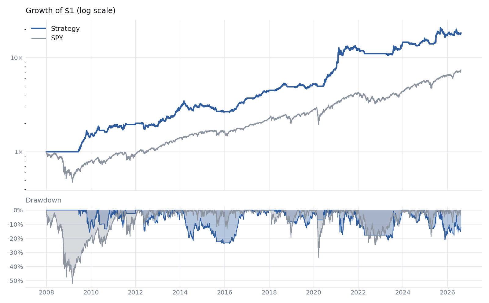
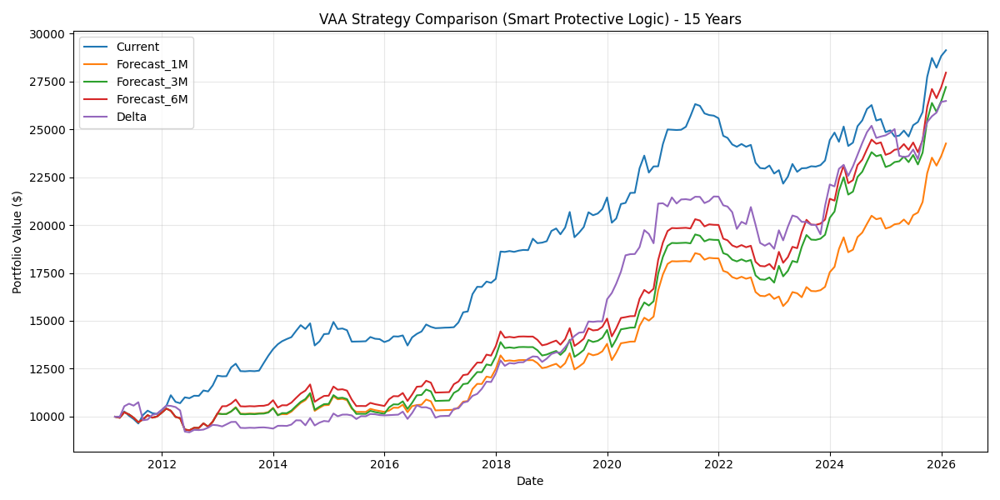

# opt_portfolio

**English** · [한국어](README.ko.md)

**US equity factor engine + tactical asset allocation (VAA) backtester.**

[](https://www.python.org/downloads/)
[](https://opensource.org/licenses/MIT)
[](https://www.linkedin.com/in/younghwan-chae/)

Two independent subsystems live in this repository.

| | **Factor engine** (`factor/`) | **VAA allocation** (`strategies/`·`analysis/`) |
|---|---|---|
| Scope | US single stocks (21,963 tickers, 1997–2026) | 7–11 ETFs |
| Question | Which stocks to buy | Which asset class to rotate into |
| Data | Sharadar direct (point-in-time, delisted included) | yfinance daily closes |
| Entry point | `opt-factor` · `opt-factor-tui` | `make run` · `run.py` |

**The two are fully isolated at the code level** — neither imports the other; the only shared symbol is `config.RISK_FREE_RATE`.

---

# 1. Factor engine

A cross-sectional US equity factor engine built so that results can be **trusted, not just produced**.
One design principle drives everything: **never fail silently.**

## Why this engine

Quant backtests fail in a small number of well-known ways. Each one is blocked structurally here.

| Common failure | How it is prevented |
|---|---|
| **Survivorship bias** — only today's survivors are in the sample | Delisted names retained (Enron, old American Airlines, Ambac verified present) |
| **Look-ahead** — using numbers before they were public | Expressions cannot touch raw tables; everything passes through `PanelContext`, which enforces `datekey` alignment |
| **Restatement contamination** — using revised figures | **First print wins** — only the number the market originally saw is stored |
| **Silent truncation** — partial data reported as success | Pagination raises `TruncatedDataError` when the expected range isn't reached |
| **Overfitting** — run hundreds of variants, report the best | **Deflated Sharpe Ratio** + **PBO** charge for the number of trials |
| **In-sample performance reporting** | Official performance is **walk-forward only**; single backtests are labelled reference-only |

## Performance

<!-- PERFORMANCE:START -->

*Adopted strategy · walk-forward out-of-sample · 2002-12 – 2026-08 (23.6y)*

<picture>
  <source media="(prefers-color-scheme: dark)" srcset="docs/images/performance-dark.png">
  
</picture>

| Metric | Strategy | SPY (same window) |
|---|---|---|
| CAGR | **23.78%** | 11.66% |
| Max drawdown | **-23.7%** | -55.2% |
| Volatility | **17.0%** | 18.6% |
| Sharpe | **1.047** | 0.418 |
| Calmar | **1.00** | 0.21 |
| **Deflated Sharpe** (72 trials) | **1.000** ✓ | — |

Cumulative 153.0× over the validation window. Holdings are not published — the universe is micro-cap and crowding would move the entry price.

**Read the headline carefully.** Restricted to the window the previous protocol covered (2007-12 onward), this strategy returns 16.92% CAGR at Sharpe 0.758 — statistically identical to the 10-year-training result (16.90% / 0.756). The entire uplift comes from the newly included 2003–2007, a small-cap bull market that alone ran at 53% CAGR. Halving the training window left the overlapping period unchanged, which is evidence of robustness, not of a better strategy.

<!-- PERFORMANCE:END -->

Currently adopted strategy: US small caps, 8 factors + 200-day moving-average timing overlay, 20 stocks, quarterly rebalance, equal weight.

**The Deflated Sharpe is the number that matters here.** It subtracts the maximum Sharpe you would expect from pure noise given how many variants were tried, leaving what is actually left over. A strategy that cannot clear 0.95 is not adopted — more than twenty candidates were rejected at this gate in this repository.

The full record is in [`docs/factor-system/07-experiment-log.md`](docs/factor-system/07-experiment-log.md) (Korean).

## Factor library — 158 factors

Factors are not written as 158 functions. A **declarative expression DSL** generates TTM / QoQ / YoY / acceleration variants automatically.

```python
from opt_portfolio.factor.dsl.expr import F
from opt_portfolio.factor.dsl.registry import factor

# Cash-based operating profitability (Ball, Gerakos, Linnainmaa & Nikolaev 2016)
CBOP = factor(
    "CBOP",
    (F.gp - _delta(F.receivables) - _delta(F.inventory) + _delta(F.liabilitiesc)) / F.assets,
    category="quality",
    direction=1,
    neutralize=("sector",),   # cross-sectional sector neutralisation
)
```

| Category | Count | Examples |
|---|---|---|
| quality | 55 | GP/A, ROIC, F-Score, accruals, net operating assets |
| growth | 26 | Revenue / earnings YoY & QoQ |
| price | 24 | Momentum 1/3/6/12M, 12-1, low volatility |
| value_price | 24 | P/E, P/B, P/S, P/FCF, P/GP |
| acceleration | 15 | Second derivative of growth |
| value_ev | 9 | EV/EBITDA, EV/GP |
| flow_proxy | 5 | 13F institutional change, insider net buying |

Only factors with a documented rationale are included — Novy-Marx (2013), Sloan (1996), Hirshleifer et al. (2004), Daniel & Titman (2006), Ball et al. (2016), plus replications from the Chen & Zimmermann open-source asset pricing library.

## Usage

> **Data requirement.** The factor engine needs a [Sharadar](https://sharadar.com) subscription (Bundle, from $29/mo) — it is the only retail-priced source that provides point-in-time fundamentals *and* delisted coverage together. Without it the engine runs but has nothing to run on. The vendor adapter is isolated behind a neutral `Provider` protocol, so swapping in another source means rewriting one file. The VAA subsystem uses free yfinance data and needs no subscription.

```bash
# Ingest data (Sharadar subscription required)
export SHARADAR_API_KEY=...
opt-factor ingest --store us.duckdb --provider sharadar \
  --tables sf1,sep,daily,actions,sp500,tickers --tickers-file universe.txt

# Screen factor predictive power — decile spread, IC, turnover
uv run python scripts/factor_lab.py --store us.duckdb --factors GP_A,PER,SIZE

# Official performance (walk-forward + Deflated Sharpe)
opt-factor optimize --store us.duckdb \
  --config configs/strategy_quantus_timed.json \
  --space configs/space_small.json --objective calmar

# What to buy today (pass current holdings to get a trade plan)
opt-factor holdings --store us.duckdb \
  --config configs/strategy_quantus_timed.json --current my_holdings.csv

# Operating console
opt-factor-tui --store us.duckdb --config configs/strategy_quantus_timed.json
```

A strategy is fully declared by one JSON file.

```jsonc
{
  "factors": ["PER", "PSR", "POR", "PGPR",
              "NETINC_GROWTH_YOY", "OPINC_GROWTH_YOY",
              "GP_GROWTH_YOY", "REVENUE_GROWTH_YOY"],
  "universe": {
    "min_mcap_usd": 5000000, "max_mcap_usd": 80000000,
    "exclude_financials": true, "exclude_distressed": true
  },
  "backtest": {
    "n_stocks": 20, "rebalance": "QE", "weighting": "equal",
    "hold_multiple": 1.0,                      // no-trade band
    "max_sector_weight": 1.0,                  // sector cap (<1 to bind)
    "cost": {"commission_bps": 50, "slippage_bps": 0}
  },
  "timing_ma_days": 200,                       // market-timing overlay (on/off)
  "target_vol": null,                          // continuous volatility targeting
  "select_top_k": 0                            // >0 selects factors inside the training window
}
```

### Portfolio construction — what is built, and what survived

Implemented is not adopted. Each technique below ships with tests; the verdict column
records what the walk-forward said about it on this universe.

| Technique | Verdict |
|---|---|
| Market-timing overlay (Faber 200-day MA) | **Adopted** — drawdown −63.8% → −23.7% |
| Equal weighting | **Adopted** — beat all six optimised schemes (DeMiguel 1/N) |
| No-trade band (`hold_multiple`) | **Rejected** — turnover −23%, return −0.86pp |
| Regime-conditional factor weights | **Rejected** — 16.90% → 15.45%, too few samples per regime |
| Volatility targeting (Moreira & Muir 2017) | **Rejected** — alone it is worse than no timing at all (Sharpe 0.513 → 0.396) |
| Parameter ensembling (`--ensemble k`) | **Rejected** — highest CAGR in the table, but drawdown −23.7% → −30.6% and Calmar 0.71 → 0.60 |
| Sector cap (`max_sector_weight`) | **Performance-neutral** — difference from zero is not measurable (t = 0.77); kept as a risk control, not a return driver |
| In-training factor selection (IC / residual contribution) | **Not adopted** — both land within noise of the fixed 8-factor set (t ≈ 0.5); the fixed set wins on Deflated Sharpe and on having fewer moving parts |

The last three exist because measurement pointed at them, not because they sound sophisticated —
e.g. the sector cap was written after the live portfolio turned out to be 32% Technology,
which is a macro bet nobody chose to make.

## Validation tooling

| Tool | Question it answers |
|---|---|
| `scripts/factor_lab.py` | Does this factor predict anything? (decile spread · monotonicity · turnover) |
| `research/ic.py` | Rank IC · IC-IR · decay profile |
| `research/overfitting.py` | **Is this result luck?** — Deflated Sharpe · PBO (CSCV) |
| `research/regime.py` | In which market state does it work? (trend × volatility, 2×2) |
| `research/selection.py` | Factor selection inside the training window — the honest form of combination search |
| `optimize/walkforward.py` | Expanding/rolling windows, embargo, per-fold parameter stability |

Seven weighting schemes ship: equal · market-cap · inverse-volatility · risk parity · HRP · mean-variance · Black-Litterman.
**Empirically, equal weighting wins here** — the DeMiguel et al. (2009) 1/N result reproduced twice in this repository's tests.

---

# 2. VAA allocation

An implementation of Wouter Keller's Vigilant Asset Allocation, validated walk-forward.

### Momentum score (Keller 13612)

```
momentum = 12·R(1M) + 4·R(3M) + 2·R(6M) + 1·R(12M)
```

### Selection rule

- Pick the top-momentum asset from the **offensive universe** (`SPY`, `EFA`, `EEM`, `AGG`).
- If **any** offensive asset shows negative absolute momentum, treat it as a risk-off signal and rotate to the top of the **defensive universe** (`LQD`, `IEF`, `SHY`).
- 50% to the VAA selection, 12.5% each to the core sleeve (`SPY`, `TLT`, `GLD`, `BIL`) — configurable.

### Results



2011–2026, $10,000 initial. Standard VAA (`Current`) reaches ~$29k versus ~$24–27k for the OU-forecast variants — **adding a prediction layer did not help.**

```bash
make run                     # interactive menu
python3 run.py --backtest    # dynamic VAA backtest
python3 run.py --optimize    # Sharpe-based weight optimisation
```

---

## Layout

```
src/opt_portfolio/
├── factor/                    # US equity factor engine
│   ├── data/                  #   vendor adapters · PIT store (DuckDB)
│   ├── dsl/                   #   expression tree · PIT context · registry
│   ├── library/               #   158 factor declarations
│   ├── universe/              #   liquidity, market-cap, sector filters
│   ├── portfolio/             #   score blending · 7 weighting schemes · shrinkage covariance
│   ├── backtest/              #   cross-sectional backtest · costs · market timing
│   ├── optimize/              #   walk-forward · grid/random/GP-EI search
│   ├── research/              #   IC · quantiles · DSR/PBO · regimes · factor selection
│   ├── holdings.py            #   today's picks · trade plan
│   └── tui.py                 #   operating console
├── strategies/                # VAA — momentum · asset selection · OU forecast (experimental)
├── analysis/                  # backtest · optimiser · risk · performance
├── core/                      # DuckDB incremental cache · positions
└── config.py                  # frozen dataclass settings
```

## Install & develop

```bash
make install        # uv sync --extra dev
make test           # pytest + coverage (297 tests)
make lint           # ruff check + format --check
make typecheck      # mypy src/
```

Dependencies are managed with **uv** (`uv.lock`). Do not use `pip install`.

## Documentation

Design documents are written in Korean and live in [`docs/factor-system/`](docs/factor-system/).

| File | Contents |
|---|---|
| `00-overview.md` | Design overview · data source rationale |
| `01-factor-spec.md` | Factor definitions |
| `02-universe-spec.md` | Universe filters |
| `04-data-contract.md` | **Store schema · PIT rules · vendor measurements · operating procedure** |
| `05-math-spec.md` | Weighting, backtest and walk-forward mathematics |
| `06-provider-review.md` | Comparison of 12 data vendors |
| `07-experiment-log.md` | **Experiment log — adopted strategy · rejection list · reproduction steps** |

## Limitations

**Factor engine**

- The **micro-cap universe** carries wide bid-ask spreads. The backtest assumes 0.5% commission and zero slippage — *that assumption is not data.*
- **Capacity is limited.** Switching to value weighting cuts Sharpe by 28%, which means the alpha sits in small names. The result will not survive at institutional size.
- **Factor selection is not charged to the Deflated Sharpe trial count.** Screening 124 factors and picking a handful is itself a search (`research/selection.py` exists to repay this debt).
- Taxes are not modelled.

**VAA**

- Optimised weights are in-sample; robustness must be checked separately.
- Fixed 0.1% transaction cost, yfinance daily closes, 5% risk-free assumption, single 15-year window.

> ⚠️ All backtests are historical and do not guarantee future returns.

## License

MIT

---

## ⭐ If this helped

If you found this useful, please **[⭐ Star](https://github.com/younghwan91/opt_portfolio)** the repository — it improves discoverability for others looking for the same thing.

- 🐛 Bugs & questions → [Issues](https://github.com/younghwan91/opt_portfolio/issues)
- 📈 Updates → [Follow @younghwan91](https://github.com/younghwan91)

## Related projects — Korean equity quant stack

Part of an open-source stack spanning market/fundamental/news collection APIs, data pipelines, backtesting and alpha research.

| Project | Description |
|---|---|
| **[kiwoom-rest-api](https://github.com/younghwan91/kiwoom-rest-api)** | Kiwoom Securities REST API Python client — 207 endpoints + real-time WebSocket |
| **[krx-fundamentals-api](https://github.com/younghwan91/krx-fundamentals-api)** | Korean company fundamentals REST API — financials, ratios, dividends, screening (DART + KRX + Naver) |
| **[krx-news-rest-api](https://github.com/younghwan91/krx-news-rest-api)** | Korean equity news & disclosure collection API (FastAPI + Redis) |
| **[kr-quant-airflow](https://github.com/younghwan91/kr-quant-airflow)** | Airflow pipelines loading prices, flows and earnings into TimescaleDB |
| **[kr-quant](https://github.com/younghwan91/kr-quant)** | KOSPI/KOSDAQ alpha research — guardrails enforcing walk-forward and random negative controls |
| **[quantbox-engine](https://github.com/younghwan91/quantbox-engine)** | Crypto futures backtest & execution engine — zero look-ahead, backtest/live parity |
| **[automated-stock-trading-systems](https://github.com/younghwan91/automated-stock-trading-systems)** | Backtester for Bensdorp's 7 non-correlated trading systems (educational reimplementation) |

## Author

**Younghwan Chae (채영환)** · [GitHub @younghwan91](https://github.com/younghwan91) · [LinkedIn](https://www.linkedin.com/in/younghwan-chae/)

The full open-source quant stack is listed on the [profile](https://github.com/younghwan91).
